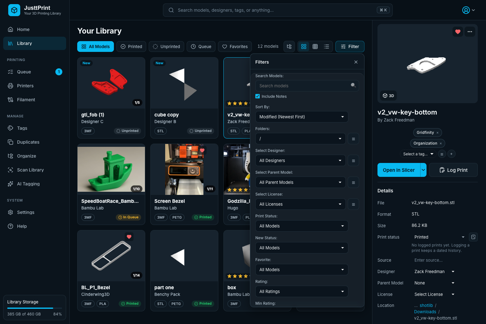
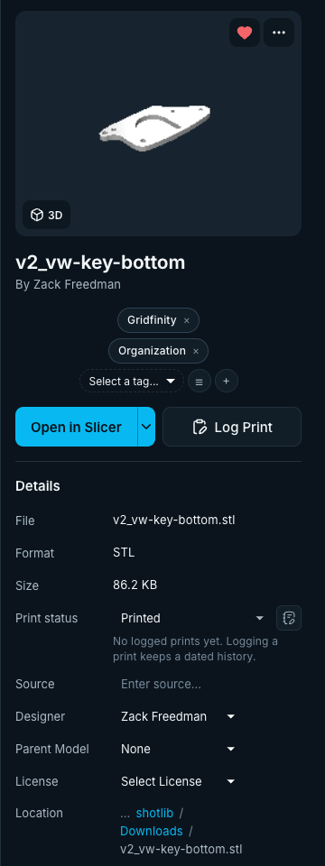
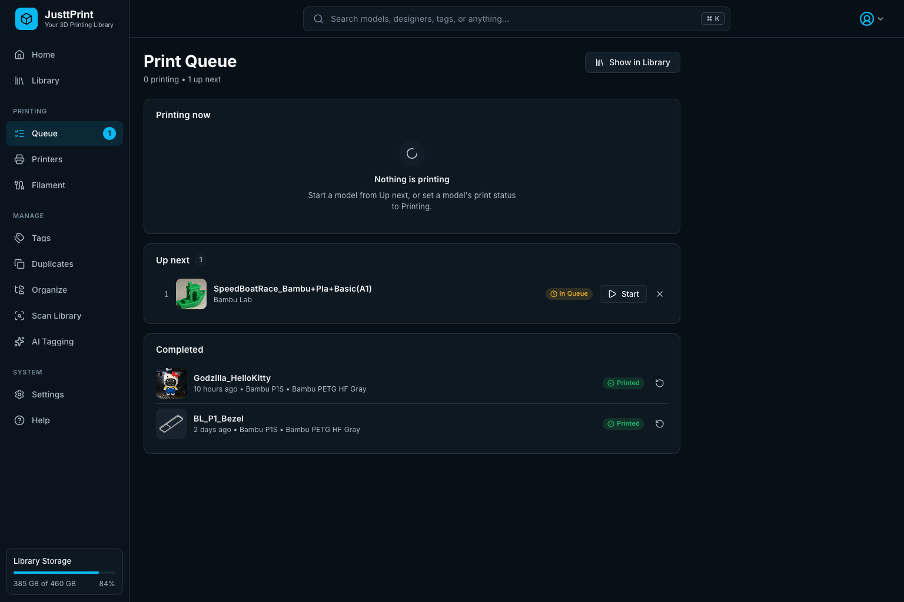
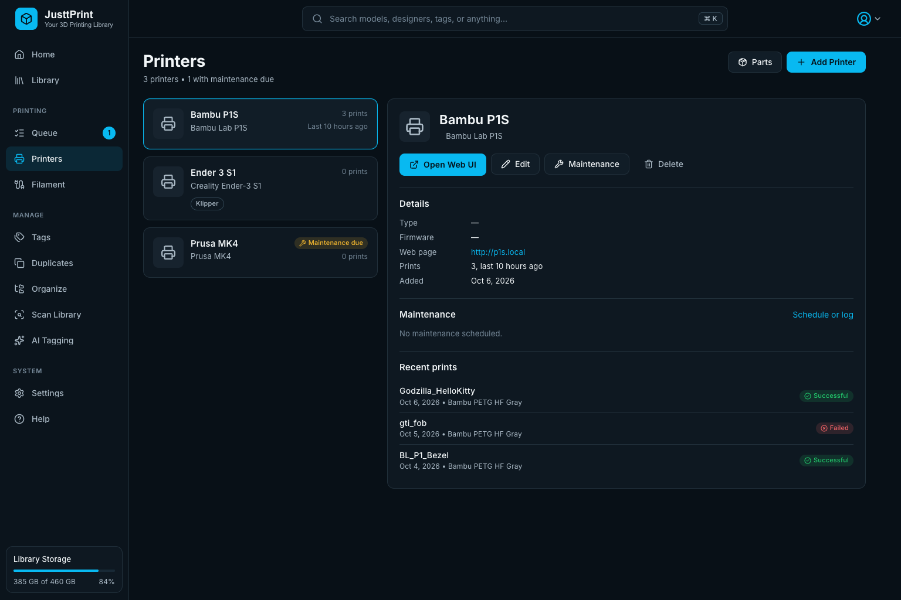
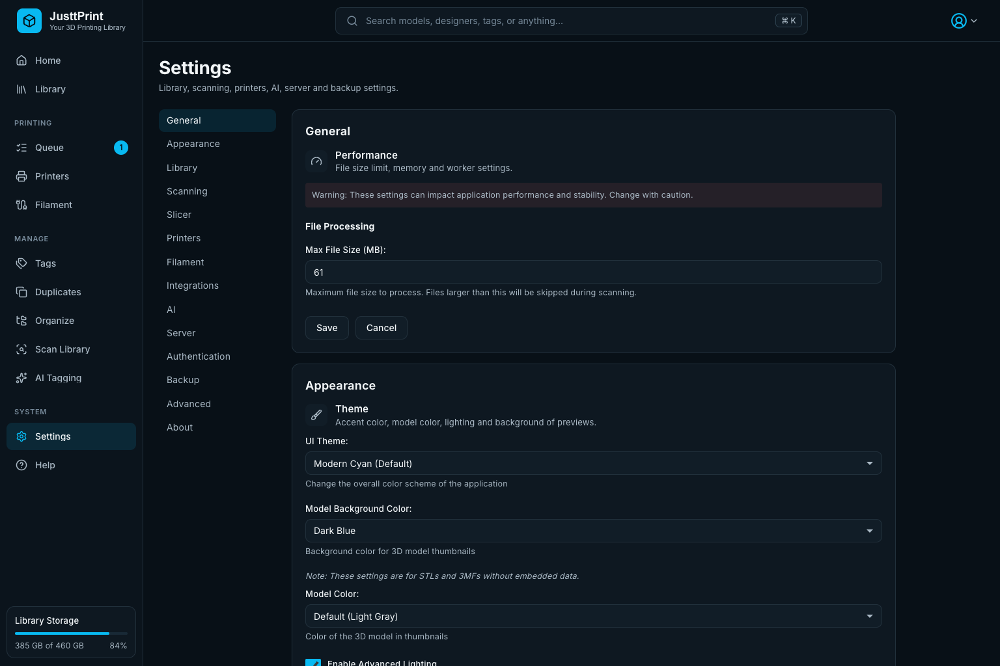

# JusttPrint Guide

JusttPrint is a self-hosted web app for your 3D printing model collection. It runs in Docker, and you use it from any browser on your network: computer, tablet or phone. This guide shows how to use it; [README.md](README.md) covers installing and setup.

## Finding your way around

The sidebar on the left holds every page:

| Section | Pages |
|---------|-------|
| (top) | **Home**, **Library** |
| Printing | **Queue**, **Printers**, **Filament** |
| Manage | **Tags**, **Duplicates**, **Organize**, **Scan Library**, **AI Tagging** |
| System | **Settings**, **Help** |

The top bar has the search box (**Ctrl/⌘ K** focuses it from anywhere) and the account menu (**Server Access**, **Log Out**). **Library Storage** at the bottom of the sidebar shows how full the disk holding your models is; scan and thumbnail progress appear just above it while they run.

On a **laptop** screen the details panel opens as a drawer from the right. On a **tablet** the sidebar shrinks to icons. On a **phone** a bottom bar holds Home, Library, Queue, Printers and **Menu** (the full sidebar), cards show two per row, and the details fill the screen.

## Getting started

1. Start the container, open `http://<server-ip>:5000` and log in.
2. Add your models folder under **Settings → Scanning → STL Home**: **Browse…** shows the folders mounted into the container (such as `/mnt/models`), or type the container path. JusttPrint scans it right away, watches it so new and deleted files show up within seconds, and scans it again on a schedule (every 60 minutes unless you change it) for anything watching misses, such as changes on a network share. **Scan Library** in the sidebar scans again at any time.
3. Thumbnails are rendered in the background; you can use the library while they appear.
4. Optional: pick an accent color under **Settings → Appearance → Theme**, set up **AI Tagging**, add your slicers under **Settings → Slicer**, your printers on **Printers** and your filament on **Filament**.

**Help → Quick Start Guide** shows a short tour in the app.

## Home

Home greets you with your library's figures (models, printed, in queue, printers; click one to open it), a render of the model you printed last, **Recent Activity** (logged prints and newly added models), **Your Printers** with maintenance reminders that are due, and the models added most recently.

## Library

The library shows your models as cards: preview, name, designer (or folder), file type and filament material, and print status. Hover a card for **Favorite**, **More** (the model menu) and the star rating.

- **Tabs**: **All Models**, **Printed**, **Unprinted**, **Queue** (queued or printing) and **Favorites**. The count next to them is the number of models shown.
- **Views**: **Grid** (cards), **Wall** (large previews only; the tile size is next to the view buttons) and **List** (one row per model with columns you can show, hide and resize).
- **Folders**: the folder button opens a folder panel beside the grid; click a folder to show only its models.
- **Selecting**: click a card to show it in the details panel. Ctrl/⌘-click or Shift-click selects several, which opens multi-edit. The arrow keys move the selection, Ctrl/⌘ A selects everything shown.
- **The model menu**: right-click a card (or press the Menu key, or Shift+F10) for Open in Slicer, 3D preview, move, rename, delete, Generate Tags and more.
- **Print status**: click a card's status badge to log a print; Shift-click it to change the status without logging.

### Search and filters

Type in the top bar to search names, designers, tags and (optionally) notes. **Filter** opens every filter: folder, designer, parent model, license, tags, print status, new models, favorites, rating, filament, file type and sort order. Active filters show as chips under the tabs; click a chip's × to remove one, or **Clear all**.

### Folder and ZIP bundles

When a scan finds two or more model files in the same folder or ZIP file, they show as one **bundle** card.

| Action | Result |
|--------|--------|
| Click the bundle | Expand or collapse its files in the grid, and show the bundle's details |
| Right-click → **Preview** | 3D preview with every part laid out side by side (up to 32 parts) |
| **Send to Slicer** (in the preview) | Sends every part to your slicer |

Single files in a folder are not grouped.

## Model details

Click a model to see it in the details panel:

- **Preview**: click it (or **3D**) for the 3D preview. Thumbnails of the model's images run underneath.
- **Name and designer**, then the **tags** (× removes one; the picker adds one, + creates a new tag).
- **Open in Slicer** sends the model to your first slicer; the arrow lists the others. **Log Print** records a print.
- **Details**: file, format, size, print status, source link, designer, parent model, license, location (click a folder to show it), date added and rating. Fields save as you change them.
- **Filament**, **Notes** (Markdown) and **Print History** (each logged print with date, printer, filament and outcome).

### Editing several models

Select several cards (Ctrl/⌘-click or Shift-click) to open the multi-edit panel. Changes there apply to every selected model as soon as you make them: print status, source, designer, parent model and license, and adding or removing a tag or filament. **Log a Print on Selected** records one print for all of them.

### Print status and history

Each model has a status (Unprinted, Want, Queued, Printing, Printed, Failed) and a print log. Logging a print (date, outcome, quantity, printer, filaments, parts used, notes) sets the status and adds a dated entry to the history; a successful print counts as a reprint after the first. The **Printed** and **Unprinted** tabs go by the logged prints, not the status alone.

## Printing

- **Queue** lists **Printing now**, **Up next** (queued models; **Start** sets one to Printing, × takes it out of the queue) and **Completed** (recent successful prints; ↻ queues one again).
- **Printers** keeps your printers: make and model, type, firmware, print count and last print. Select one for its web page (**Open Web UI**), maintenance reminders and log, and recent prints. **Add Printer**, **Edit** and **Maintenance** open the printer forms; **Parts** opens the Parts Manager (screws, bearings and other stock that logged prints use up).
- **Filament** shows each filament in your catalog as a spool in its color, with material, diameter, how many models use it, and its prints. Search and the material chips narrow the list; **Show models** opens the library filtered to that filament. **Add Filament** adds one by hand; **Spoolman** syncs your catalog from a Spoolman server.

## Managing the library

- **Tags** lists every tag with how many models use it. Create, rename (renaming onto an existing tag merges the two), delete, or show a tag's models.
- **Duplicates** finds identical files by their contents and shows each group side by side. **Keep this** marks the other copies for deletion; **Easy** keeps one copy of each group for you (preferring a folder you choose). Nothing is deleted until you confirm **Delete Selected**. You can limit the search to the models currently shown.
- **Organize** moves the models in a scanned folder into a folder structure you choose (up to four levels, such as designer / parent model / license). **Preview** shows what will happen first; each original is removed only after its copy is checked, and files that are not in the library stay where they are. The models folder must be mounted without `:ro`.
- **AI Tagging** sets up the AI service; then select models, right-click and choose **Generate Tags**, and tick the tags to keep. See [AI tagging](#ai-tagging).
- **Settings → Library** has the Metadata Manager (rename or remove designers, licenses and parent models everywhere), Library Stats, Print Roulette (random models to print), Clear New Flag and Purge Models.

## AI tagging

AI tagging looks at a model's thumbnail, name and folder names and suggests tags. You review them before they are saved.

1. Click **AI Tagging** in the sidebar.
2. Pick a service: OpenAI, Claude or Gemini need an API key; **Puter** signs in to your Puter account instead; **custom** works with a local OpenAI-compatible server such as Ollama or LM Studio (no key).
3. Pick a model and the tagging options (number of tags, replace / merge / append, categories, detail level), then save.
4. Select models, right-click and choose **Generate Tags**. **Tag from Folder** copies folder names onto the models as tags without asking the AI.

Tips: start with a few models, use **merge** to keep the tags you already have, and review the suggestions before applying them.

## Settings

**Settings** is one page with an index on the left:

| Group | What is there |
|-------|---------------|
| General | Performance: the largest file a scan processes |
| Appearance | Theme: accent color, and the background, model color and lighting of thumbnails |
| Library | Metadata Manager, Library Stats, View Entire Library, Print Roulette, Clear New Flag, Purge Models |
| Scanning | STL Home, File Types (ZIP files, extra types, skipped folders), Scan a Folder |
| Slicer | Your slicers, and the helper for Send to Slicer |
| Printers, Filament | Links to those pages, and the Parts Manager |
| Integrations | MCP Server: connect an AI app to your library |
| AI | AI tagging settings |
| Server | HTTPS / SSL and the listen port, Restart Server |
| Authentication | Server Access (password and API token), Log Out |
| Backup | Automatic backups, download a backup, export the library, restore |
| Advanced | Regenerate Thumbnails, Generate Missing Thumbnails, System Report |
| About | Version, update check, license |

Most forms are shown right on the page: change the values and click **Save**.

### Send to Slicer

Slicers run on your computer, not on the server. Add each slicer under **Settings → Slicer** with its path on your computer, then download and run the JusttPrint helper there once. **Open in Slicer** (details panel, model menu) and **Send to Slicer** (3D preview) then download the model and open it in that slicer. On a Mac the helper opens a new slicer window for each send.

### MCP server

AI apps (Claude Code, Claude Desktop, Cursor, VS Code and others) can connect to JusttPrint at `http://<server-ip>:5000/mcp` to search the library, edit tags and metadata, log prints and set thumbnails. **Settings → Integrations → MCP Server** shows the setup for the app you pick, with the address and API token filled in. Anyone with the token can read and change your library.

## Keyboard

**Help → Keyboard Shortcuts** lists them all. The main ones: **Ctrl/⌘ K** search, **Tab** moves between cards (each card is one stop), **Enter** or **Space** selects, the arrow keys move the selection, **Ctrl/⌘ A** selects all, **Ctrl/⌘ E** multi-edit, **Escape** closes a dialog, drawer or popover. A **Skip to content** link is the first Tab stop on every page.

## Your data

- The database, thumbnails and settings live in the container's data folder (`/root/.config/justtprint`); mount it as a volume so it survives updates.
- A backup copy (`backup_justtprint.db`) is written every time the server stops.
- **Settings → Backup → Automatic Backups** copies the database on a schedule (every day unless you change it) and keeps the newest copies (7 unless you change it). They go to `backups` in the data folder, or to a folder you choose with **Browse…**; a folder on another disk also protects against a disk failure. Each backup in the list can be downloaded or restored.
- **Settings → Backup** also downloads a backup by hand or restores one from a file. Keep a backup before removing the container or its data volume.

## Tips

- Use tags, designers and parent models consistently; the Metadata Manager and the Tags page clean them up later.
- Generate Missing Thumbnails is much faster than regenerating all of them.
- Check **Duplicates** now and then, limited to the models in view for a large library.
- Print Roulette (**Settings → Library**) finds forgotten models worth printing.
