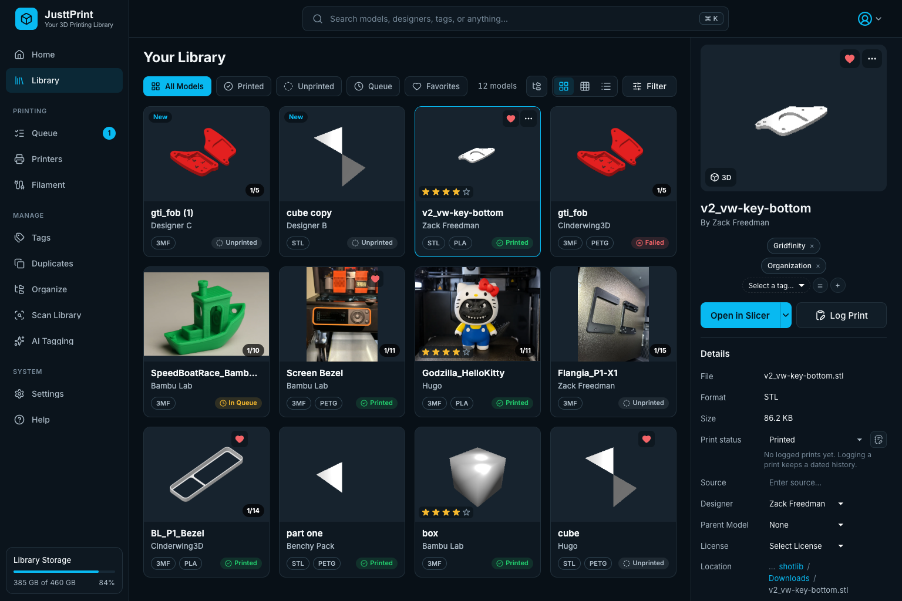
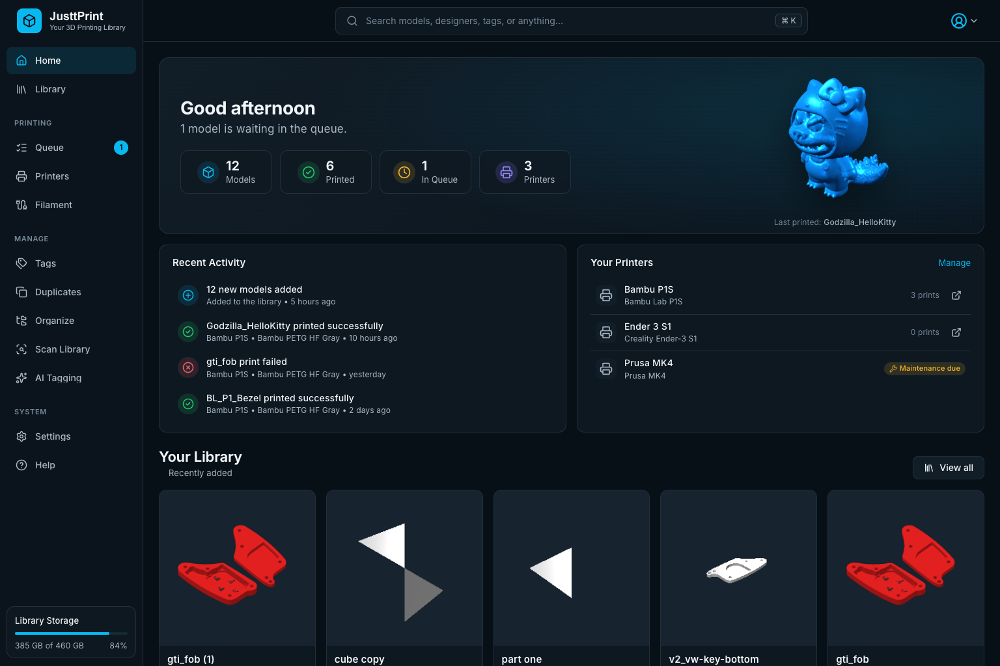
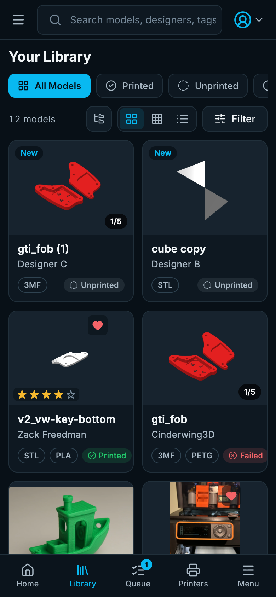

# JusttPrint


**Version 7.5.0**

JusttPrint is a self-hosted web app for your 3D printing model collection. It runs in Docker on a NAS, home server or PC, and you use it from any browser on your network, including phones and tablets.



## Features

- **A home for your printing**: Home shows your figures, recent prints and printers; the Library has tabs for Printed, Unprinted, Queue and Favorites
- **Print queue and printers** pages: what is printing and up next, and your printers with their web pages and maintenance reminders
- **Works on phones and tablets**: a bottom bar and full-screen details on phones, an icon rail on tablets, finger-sized controls on touch screens, and **Install App** for the home screen (Android and desktop need HTTPS)
- **Automatic scanning** of STL, 3MF, ZIP and other model files, with thumbnails rendered by the JusttPrint backend
- **Upload from the browser**: drop model files on the page (or use **Upload** in the Library) to save them into a library folder; large files (many GB) go in pieces that resume after a lost connection
- **Add from links**: paste a list of Printables, Thingiverse or MakerWorld links and each model is added with its name, designer, license, picture and source link; links already in the library are skipped
- **Several people at once**: edits show up live in every open browser, and two people editing the same field are asked whose version stays instead of one silently overwriting the other
- **User accounts** for family or a makerspace: admins, editors who manage the library, and viewers who browse and download
- **Collections**: group models from any folders into projects, gift lists or spare-part sets
- **Share links and QR codes**: a read-only page for a model or a collection that opens without an account, with optional downloads and an expiry date
- **Statistics**: prints per month, success rate, top designers, most printed models and printers
- **3D preview** of single models or every part in a folder or ZIP bundle
- **Tags, designers, licenses, notes and source links** for every model
- **Print status and history**: Unprinted, Want, Queued, Printing, Printed, Failed, with dated print logs
- **Search and filters** by name, folder, tag, designer, status and more
- **Multi-edit** to change many models at once
- **Undo** for metadata and tag edits: the Undo button after a change, or Ctrl/⌘ Z for the last 20
- **Duplicate finder** based on file contents
- **AI tagging** with OpenAI, Claude, Gemini, Puter or a local server such as Ollama; runs keep going in the background, with progress in every browser
- **MCP server** so AI agents can search and update your library
- **Open in OrcaSlicer** with one click, nothing to install besides OrcaSlicer; other slicers through a small helper on your computer
- **Backup and restore** of the library database from the browser, and **automatic backups** on a schedule
- **Print Roulette** to pick a random model

See [GUIDE.md](GUIDE.md) for how to use each feature and [CHANGELOG.md](CHANGELOG.md) for what changed.

| Home | On a phone |
|------|------------|
|  |  |

<a id="server-mode"></a>

## Quick Start

You need [Docker](https://www.docker.com/get-started) (Docker Desktop on Windows and Mac).

1. Create a folder for JusttPrint, for example `justtprint`, and open a terminal in it.
2. Create a file named `docker-compose.yml` in that folder with this content. Change the two lines marked `CHANGE`:

   ```yaml
   services:
     justtprint:
       image: ace2123/justtprint:latest
       container_name: justtprint-server
       ports:
         - "5000:5000"
       volumes:
         - ./data:/root/.config/justtprint
         - /path/to/your/models:/mnt/models:ro     # CHANGE: your models folder
       environment:
         - STL_HOME=/mnt/models
         - JUSTTPRINT_PASSWORD=choose-a-password   # CHANGE: your login password
         - PUID=1000
         - PGID=1000
       restart: unless-stopped
       mem_limit: 8g
       mem_reservation: 1g
   ```

3. Start it:

   ```bash
   docker compose up -d
   ```

4. Open `http://<docker-host-ip>:5000` (or `http://localhost:5000` on the same computer) and log in with your password.

JusttPrint scans `/mnt/models` right away and then every 60 minutes. Thumbnails are made in the background.

## Docker Run

If you prefer one command instead of a Compose file:

```bash
docker run -d --name justtprint-server \
  -p 5000:5000 \
  -v ./data:/root/.config/justtprint \
  -v /path/to/your/models:/mnt/models:ro \
  -e STL_HOME=/mnt/models \
  -e JUSTTPRINT_PASSWORD='choose-a-password' \
  --memory 8g \
  --restart unless-stopped \
  ace2123/justtprint:latest
```

On Windows, write the models path like `C:/Users/you/Models:/mnt/models:ro`.

## Docker Compose options explained

| Option | What it does |
|--------|--------------|
| `image` | The JusttPrint image from Docker Hub. `latest` is the newest release; use a version such as `ace2123/justtprint:5.0.0` to stay on one. Works on Intel/AMD and ARM. |
| `container_name` | A fixed name, so commands like `docker logs justtprint-server` work. |
| `ports` | `host:container`. Open the app at the host port. If 5000 is taken (Synology DSM, macOS AirPlay), use `"5055:5000"` and open port 5055. |
| `./data:/root/.config/justtprint` | Where the database, thumbnails, backups and settings are saved on your computer. **Keep this folder**; it holds your library. |
| `/path/to/your/models:/mnt/models:ro` | Makes your models folder visible inside the container as `/mnt/models`. `:ro` is read-only; remove it to allow delete, move and Organize Library. Add more lines for more folders. |
| `environment` | Settings, see [Environment variables](#environment-variables). |
| `restart: unless-stopped` | Starts JusttPrint again after a reboot or crash. |
| `mem_limit` / `mem_reservation` | Most RAM the container may use / RAM kept for it. 4 GB or more is recommended for large libraries. |

**Important:** inside JusttPrint, always use the container path (`/mnt/models/...`), never the path on your computer.

## Environment variables

All are optional. You can change most of these later under **Settings** in the app.

| Variable | What it does |
|----------|--------------|
| `JUSTTPRINT_PASSWORD` | Password of the admin account. Applied on every start, which is also how to reset a forgotten one. If unset, a random password is printed once in `docker logs justtprint-server`. |
| `JUSTTPRINT_USERNAME` | User name of that admin account (default `admin`). Other accounts are added under **Settings → Authentication → Users**. |
| `JUSTTPRINT_MAX_UPLOAD_MB` | Largest file the browser may upload, in MB (default `2048`; `10240` for 10 GB). |
| `JUSTTPRINT_UPLOAD_CHUNK_MB` | Size of the pieces uploads are sent in, in MB (default `16`). Lower it only if a proxy in front takes less per request. |
| `STL_HOME` | Folders to scan automatically, as container paths. Several: `/mnt/models,/mnt/archive`. |
| `STL_HOME_EXCLUDE` | Folders inside STL Home to skip, for example `/mnt/models/cache`. |
| `JUSTTPRINT_WATCH_FOLDERS` | `true` or `false`: watch the STL Home folders for changes (default on). |
| `PUID` / `PGID` | User and group the app runs as. Match the owner of your models folder (`id -u` and `id -g`; Synology is often `1026`/`100`). Default `1000`/`1000`. |
| `JUSTTPRINT_ENABLE_ZIP` | `true` or `false`: also scan models inside ZIP files. |
| `JUSTTPRINT_FILE_TYPES` | Extra file types to scan, for example `obj,step,ply,gcode`. |
| `JUSTTPRINT_SCAN_EXCLUDE` | Folder names to skip while scanning, for example `cache,renders`. |
| `JUSTTPRINT_AI_SERVICE` | AI tagging service: `openai`, `claude`, `gemini`, `puter` or `custom`. |
| `JUSTTPRINT_AI_API_KEY` | API key for that service (never written to the log). |
| `JUSTTPRINT_AI_MODEL` | AI model name, for example `gpt-5-nano`. |
| `JUSTTPRINT_AI_ENDPOINT` | Address of the AI service for `custom`, for example a local Ollama server. |
| `JUSTTPRINT_AUTO_BACKUP` | `true` or `false`: back up the database automatically (off by default). |
| `JUSTTPRINT_BACKUP_INTERVAL_HOURS` | Hours between automatic backups (default `24`). |
| `JUSTTPRINT_BACKUP_KEEP` | How many automatic backups to keep (default `7`). |
| `JUSTTPRINT_BACKUP_DIR` | Folder for automatic backups, as a container path, for example `/backups` (mount a volume there). Default: `backups` in the data folder. |
| `JUSTTPRINT_PORT` | Port inside the container (default `5000`). Change the `ports` line to match. |
| `JUSTTPRINT_ALLOWED_ORIGINS` | Your public address when behind a reverse proxy, for example `https://library.example.com`. |
| `JUSTTPRINT_TRUST_PROXY` | Number of reverse proxies in front (usually `1`). Leave unset without a proxy. |
| `JUSTTPRINT_GPU` | Thumbnail rendering: `auto` (default), `nvidia` or `swiftshader` (CPU). |
| `JUSTTPRINT_MAX_OLD_SPACE_MB` | Raise if the log shows `OOM error in V8`. |
| `JUSTTPRINT_LOG_LEVEL` | How much `docker logs` shows: `error`, `warn`, `info` (default) or `debug` (every query, file and click, for tracking down a problem). |
| `JUSTTPRINT_TLS_CERT` / `_KEY` / `_CA` | Certificate files for HTTPS. Easier: **Settings → JusttPrint Backend → HTTPS / SSL**. |

`JUSTTPRINT_PASSWORD`, the scan settings, the AI settings and the backup settings win over the app's settings on every start. `STL_HOME`, `STL_HOME_EXCLUDE` and `JUSTTPRINT_PORT` only fill an empty setting, so changes made in the app are kept (set `JUSTTPRINT_ENV_OVERRIDES_SETTINGS=1` to apply them every start).

## Using the Web App

The sidebar holds every page: **Home**, **Library**, **Collections**, **Queue**, **Printers**, **Statistics**, **Tags**, **Duplicates**, **Organize**, **Scan Library**, **AI Tagging**, **Settings** and **Help**. On a phone, open it with **Menu** in the bottom bar. Search from the top bar (Ctrl/⌘ K).

- **Log in** with your user name and password; the first account is `admin` (or `JUSTTPRINT_USERNAME`) with the `JUSTTPRINT_PASSWORD` password. Browsers stay logged in for 30 days. Change your password from the account menu (top right) → **Change Password**; this logs you out in every browser.
- **User accounts**: under **Settings → Authentication → Users**, an admin adds people and gives each a role. **Viewers** browse, preview and download; **Editors** also edit models, tags and the print log, upload, move and delete files; **Admins** also change settings, backups, JusttPrint backend access and accounts. The JusttPrint backend checks every action, and each person sees only the pages, menu items and buttons their role can use (a viewer's details panel is read-only). Each person keeps their own view, sort, column layout, panel sizes and color scheme; everything else under Settings is the same for everyone.
- **Upload models**: drop files anywhere on the page, or click **Upload** in the Library, choose a library folder and upload. Files go in 16 MB pieces, so large files (5 or 10 GB, up to `JUSTTPRINT_MAX_UPLOAD_MB`) get through reverse proxies and Cloudflare; a piece that fails is sent again, and after a lost connection, a reload or a restart of the JusttPrint backend, uploading the same file again continues where it stopped. Files are never replaced (a taken name becomes `Name (2).stl`), only types the library scans are accepted (**Settings → Scanning → File Types**), and the folder is scanned afterwards so the models appear with thumbnails. Scans skip files over the size limit under **Settings → General → Performance** (50 MB unless you change it): raise it before uploading bigger models, or they are saved but not added. Editors and admins only.
- **Add Links**: click **Add Links** in the Library and paste Printables, Thingiverse or MakerWorld model links (one per line, up to 200). Each becomes an online model with the name, designer, license and picture from the site and the link as its source; the dialog marks links already in your library (online models, or files whose source is the link) and skips them. The JusttPrint backend fetches the details, so it needs outgoing HTTPS to those sites. Editors and admins only.
- **Collections** (sidebar): choose **Add to Collection…** in a model's menu (it works on a selection too) or make one with **New Collection**; a model can be in several. Everyone can browse collections; editors and admins change them.
- **Share links**: **Share…** in a model's menu, or **Share** on a collection, makes a read-only link with a QR code (to scan, or to print and stick on a box of parts). The page shows names, pictures, designer, license, tags and source link, never notes or file locations; downloads only when you allow them; links can expire after 1 to 90 days. Anyone who can reach your JusttPrint backend's address can open a link, so links work outside your home network only if JusttPrint is reachable from there (for example behind a reverse proxy with HTTPS). See and turn off every link under **Settings → Sharing**.
- **Statistics** (sidebar): prints per month by outcome, the success rate (printed out of printed and failed), the designers, models and printers printed most, and how many models were added, for the last 6 or 12 months, 2 years or all time. The figures come from the print log, so log your prints to see them.
- **STL Home**: under **Settings → Scanning → STL Home**, add the folders to scan with **Browse…** (it lists the volumes mounted into the container) or by typing a container path such as `/mnt/models`, and set how often (default 60 minutes). JusttPrint also watches these folders, so new, changed and deleted files show up within seconds; the timed scan catches anything watching misses (network shares and Docker Desktop on Mac or Windows may not report changes). **Scan Library** in the sidebar scans right away. Remove every folder to stop automatic scans.
- **Scan a folder once**: **Settings → Scanning → Scan a Folder**, then choose the folder (or type its container path).
- **HTTPS**: open **Settings → JusttPrint Backend → HTTPS / SSL** for a self-signed certificate, Let's Encrypt (also publish port `80:80`) or your own certificate files. Use HTTPS if JusttPrint can be reached from outside your network.
- **Open in Slicer**: for OrcaSlicer, click **Add OrcaSlicer (no helper)** under **Settings → Slicer** and save; Open in Slicer then hands it a link and it downloads the model itself (OrcaSlicer must reach the JusttPrint backend's address; with HTTPS it needs a trusted certificate). For other slicers, install the helper on your computer from the same page.

## AI Tagging

AI tagging looks at a model's thumbnail and name and suggests tags. You review them before they are saved.

1. Click **AI Tagging** in the sidebar (or open **Settings → AI**).
2. Pick a service and enter its API key (OpenAI, Claude, Gemini). Puter needs no key: click **Sign In** and log in to your Puter account in the popup (allow popups for JusttPrint); usage counts against that account. For a local server such as Ollama or LM Studio, pick `custom`, enter its address (for example `http://<server-ip>:11434/v1` for Ollama) and leave the key blank.
3. Pick a model, and save.
4. Select models, right-click and choose **Generate Tags**, then tick the tags you want and apply.

You can also set this up with the `JUSTTPRINT_AI_*` [environment variables](#environment-variables). When you use AI tagging, the thumbnail, file name and folder names are sent to the service you picked.

## MCP Server

AI apps can connect to JusttPrint over MCP (Model Context Protocol) to search the library, edit tags and metadata, log prints and more. For example, ask "tag everything in the Kitchen folder as kitchen".

1. Open **Settings → Integrations → MCP Server**.
2. Pick your app under **Set up in**: Claude Code, Claude Desktop, Cursor, VS Code, or another MCP client.
3. Copy the command or config it shows (the address and your API token are filled in) and follow the line above it.

The address is `http://<docker-host-ip>:5000/mcp`. Claude Desktop connects through `mcp-remote`, which needs [Node.js](https://nodejs.org/) on that computer.

This feature is experimental. Anyone with the API token can read and change your library; you can replace the token under **Settings → Authentication → JusttPrint Backend Access**.

## Network Shares

Mount the share on the host first, then add it as a volume, and use the container path in JusttPrint.

**Windows:** map the share to a drive letter, then mount the drive:

```bash
net use Z: \\server\share /persistent:yes
```
```yaml
      - Z:/:/mnt/share:ro
```

**Linux:** mount the share on the host (needs `cifs-utils`), then mount that folder:

```bash
sudo mkdir -p /mnt/share
sudo mount -t cifs //server/share /mnt/share -o username=user,password=pass,uid=1000,gid=1000
```
```yaml
      - /mnt/share:/mnt/share:ro
```

Then set `STL_HOME=/mnt/share/models` (or add it under **Settings → STL Home**). Windows paths like `Z:\models` or `\\server\share` do not work inside JusttPrint.

A network share does not tell the container when files change, so folder watching cannot see changes made from other computers. The timed STL Home scan picks them up instead; lower **Update Frequency** under **Settings → Scanning → STL Home** if you want them sooner.

## NVIDIA GPU (optional)

Thumbnails render on the CPU by default. To use an NVIDIA card, install the [NVIDIA Container Toolkit](https://docs.nvidia.com/datacenter/cloud-native/container-toolkit/latest/install-guide.html) on the host and add this to your service:

```yaml
    gpus: all
    environment:
      - NVIDIA_VISIBLE_DEVICES=all
      - NVIDIA_DRIVER_CAPABILITIES=graphics,compute,utility
```

`graphics` is required. Recreate the container (`docker compose up -d --force-recreate`) and check **Help → System Report**.

## Managing the Container

Run these in the folder with `docker-compose.yml`:

| Task | Command |
|------|---------|
| Update to the newest version | `docker compose pull && docker compose up -d` |
| See the log | `docker compose logs -f` |
| Stop | `docker compose down` |
| Start | `docker compose up -d` |
| Restart | `docker compose restart` |

With Docker Run, update by pulling the image (`docker pull ace2123/justtprint:latest`), removing the container (`docker rm -f justtprint-server`) and running the same `docker run` command again. Your library is safe in `./data`.

**Backups:** turn on **Automatic Backups** under **Settings → Backup**: the JusttPrint backend copies the database every day (or 6 hours, 12 hours, a week) and keeps the newest 7 (you choose). They go to `./data/backups` unless you pick another folder; to survive a failed disk, mount a folder on another disk (for example `- /mnt/usb/justtprint-backups:/backups`) and choose `/backups`. Each one can be downloaded or restored from the same page. You can also download a backup by hand there (the copy in the JusttPrint backend is deleted an hour later), or copy the `./data` folder while the container is stopped.

## Upgrading to 7.0

7.0 removes everything to do with filament: the Filament page, the catalog, the Filament section of a model's details, the filament picker in Log Print, the Filament filter, the material badge on cards, the filament statistics and the MCP filament tools. On the first start, the filament tables are deleted from the database (your print history, printers and parts stay). Take a backup first if you might want them back (**Settings → Backup**); a 6.x version restored from that backup has them again.

## Upgrading to 6.2

6.2 adds user accounts. The first start turns your password into the `admin` account (or `JUSTTPRINT_USERNAME`): log in again with that user name and your usual password. Scripts that log in with only a password still work. The API token for MCP stays the same and acts as an admin.

## Upgrading to 6.0

6.0 removes the Filament Manager dialog and Spoolman support. Your filament catalog, the filaments on your models and in your print history stay; filaments that came from Spoolman become ordinary filaments. On the first start the Spoolman settings are deleted, so keep a backup if you may go back to 5.x. Add filaments on the **Filament** page (see **Upgrading** under 6.0.0 in [CHANGELOG.md](CHANGELOG.md)).

## Upgrading to 5.0

JusttPrint 5 is a new interface; your library, settings and data folder are unchanged, so pulling the new image is all it takes. The old menu bar is gone: everything it had is on the sidebar's pages, under **Settings** or under **Help** (see **Upgrading** under 5.0.0 in [CHANGELOG.md](CHANGELOG.md)).

## Upgrading from Printventory

JusttPrint 4.0.0 is the renamed Printventory. The data folder, database file and environment variables have new names, so an existing install needs a few one-time steps. See **Before upgrading** under 4.0.0 in [CHANGELOG.md](CHANGELOG.md).

## Troubleshooting

- **Can't open the page:** check the container is running (`docker ps`), the port is free, and your firewall allows it.
- **Forgot the password:** set `JUSTTPRINT_PASSWORD` and restart the container; it resets the admin account (`admin`, or `JUSTTPRINT_USERNAME`). An admin resets other users' passwords under **Settings → Authentication → Users**.
- **Uploads fail behind a reverse proxy:** uploads go in 16 MB pieces, so a proxy must take at least that per request (nginx's default is 1 MB: set `client_max_body_size 32m;`), or lower `JUSTTPRINT_UPLOAD_CHUNK_MB`.
- **An uploaded model does not appear:** it is larger than the scan limit under **Settings → General → Performance**; raise the limit and scan again.
- **No models found:** the path in JusttPrint must be the container path (`/mnt/models`), and that folder must be mounted. Check with `docker exec justtprint-server ls /mnt/models`.
- **Permission errors when moving or deleting:** remove `:ro` from the mount and set `PUID`/`PGID` to the owner of your files.
- **Disconnects or `OOM error in V8` in the log:** give the container more memory (`mem_limit`), and raise `JUSTTPRINT_MAX_OLD_SPACE_MB` if needed.
- **Behind a reverse proxy, actions fail:** set `JUSTTPRINT_ALLOWED_ORIGINS` to your public address and allow WebSocket upgrades on the proxy.

## Privacy

JusttPrint does not collect usage data. It only contacts outside services to check GitHub for updates (turn off under **Settings → About → About JusttPrint**), for AI tagging and page imports when you use them.

## License

MIT License, see [LICENSE.txt](LICENSE.txt).

## Support

Open an issue at [github.com/ngolston/JusttPrint](https://github.com/ngolston/JusttPrint/issues), or see [GUIDE.md](GUIDE.md).
