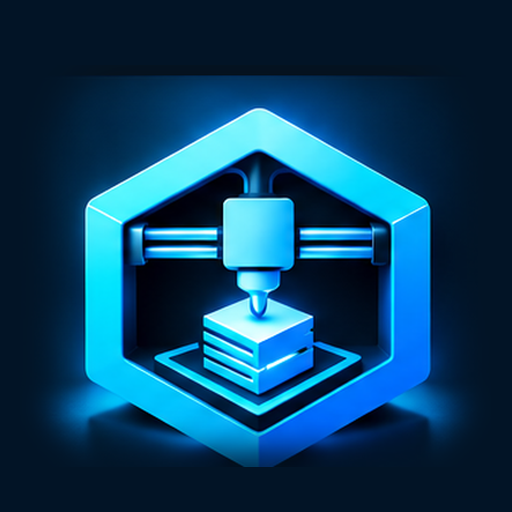

# Printventory

**Version 2.3.0**

Printventory is an Electron-based desktop application for managing your 3D printing model collection. It helps you organize, catalog, and manage STL and 3MF files with powerful features including automatic scanning, thumbnail generation, tagging, and duplicate detection.



## Features

### Core Functionality
- **Directory Scanning**: Automatically scan and catalog STL and 3MF files (up to 50MB per file)
- **3D Model Preview**: View thumbnails of your 3D models with customizable background colors
- **File Management**: Quick access to file locations, delete files with database cleanup
- **Database Backup & Restore**: Protect your data with backup and restore functionality

### Organization & Metadata
- **Tagging System**: Organize models with custom tags and categories
- **Designer Tracking**: Assign and track designer information for each model
- **Print Status & History**: Track Unprinted / Want / Queued / Printing / Printed / Failed, log reprints with date and notes, and filter by last printed or ever printed
- **Filament catalog**: Assign filaments to models and optionally sync the catalog from Spoolman (pull-only)
- **Source URLs**: Store links to where you found or purchased models
- **Notes**: Add custom notes to any model
- **Parent/Child Relationships**: Link related models together
- **Folder & ZIP bundle grouping**: Automatically group models from the same subfolder or ZIP archive; preview all parts in one 3D view
- **License Tracking**: Assign licenses to models

### Advanced Features
- **Server Mode**: Run Printventory as a web server accessible from any device on your local network (see [Server Mode](#server-mode) section for details)
- **MCP Server**: Connect a local AI agent to search the library, read model details, and write thumbnails (see [MCP Server](#mcp-server))
- **Multi-Edit Mode**: Select and edit multiple models simultaneously for batch operations
- **Duplicate Detection**: Find duplicate files based on content hash with visual comparison, optionally limited to the current library filters
- **Print Roulette**: Randomly select models from your collection
- **AI Tagging**: Automated tag suggestions using AI
- **3D bundle preview**: Open every STL/3MF in a folder or ZIP in a single preview layout
- **Send to Slicer from preview**: Open the current model or entire bundle in your configured slicer (new instance when already running)
- **Search & Filter**: Real-time search by filename and filter by designer, folders, tags, print status, filament, parent model, or license
- **Tag Manager**: Comprehensive tag management interface
- **Metadata Editor**: Bulk metadata editing capabilities
- **Thumbnail Management**: Generate, regenerate, or purge model thumbnails

### User Interface
- **Responsive Grid Layout**: Browse models in an intuitive grid view
- **Context Menu**: Quick actions via right-click menu
- **Sort Options**: Sort by name, size, or date
- **Auto-save**: Changes are automatically saved

For a complete list of features and detailed usage instructions, see the [GUIDE.md](GUIDE.md) file.

See [CHANGELOG.md](CHANGELOG.md) for recent feature additions and migration notes.

## Installation

### Pre-built Releases

Download the latest release for your platform:
- **Windows**: `Printventory-Setup-2.3.0.exe` (NSIS installer)
- **macOS**: Universal binary (Intel and Apple Silicon) DMG
- **Linux/Docker**: `printventory/printventory:latest` on Docker Hub (or `printventory-docker-2.3.0.zip`)

### Data Storage

- **Windows**: `%LOCALAPPDATA%\Printventory`
- **macOS**: `~/Library/Application Support/Printventory`

The database and thumbnails are preserved during updates. Backups are automatically created before updates.

### Network Connections

Printventory does not collect usage data. It only connects to outside services in these cases:

- **Update check**: on startup, after the terms are accepted, it asks GitHub for the latest release of `ngolston/Printventory`. Turn this off under **About → Updates**.
- **AI tagging**: when you use it, the model's thumbnail, file name and folder names go to the AI service you configured (OpenAI-compatible endpoint or Puter).
- **Support logs**: only when you choose **Send Support Logs** and confirm. API keys and webhook URLs are removed from the logs before upload.
- **Page imports and Spoolman**: when you import from a model website or sync filaments, it contacts that site or your Spoolman server.

## Server Mode

Printventory can run in **Server Mode**, allowing you to access your 3D model library from any device on your local network through a web browser. This is particularly useful for accessing your collection from multiple computers or devices without installing the application on each one.

### What is Server Mode?

Server Mode runs Printventory as an HTTP server on port 5000, making it accessible from any device on your local network through a web browser. The application interface is served via HTTP, and all functionality remains available remotely.

### Starting Server Mode

To start Printventory in Server Mode, launch it with the `--server` flag:

**Windows:**
```bash
printventory.exe --server
```

**Command Line:**
```bash
printventory --server
```

The server will start and continue running until you close the application. You'll see console output indicating the server is running:
```
Printventory server mode started
Server running at http://0.0.0.0:5000
Access from remote browsers: http://<your-ip>:5000
Server mode requires UNC paths for all file operations
```

### Accessing the Server

Once started, you can access Printventory from any browser on your network:

```
http://<your-computer-ip>:5000
```

For example, if your computer's IP address is `192.168.1.100`:
```
http://192.168.1.100:5000
```

### Logging In

Server Mode requires a password. Browsers log in once and stay logged in for 30 days.

- **First start**: if no password is set, Printventory creates one and prints it in the server log (`docker logs printventory`). It is shown only once.
- **Set it yourself**: start with the `PRINTVENTORY_PASSWORD` environment variable. It replaces the stored password on every start, which is also how to reset a forgotten password.
- **Change it**: **Tools → Server Access** (password at least 8 characters). Changing it logs out every browser.
- **MCP clients and scripts**: send `Authorization: Bearer <API token>`. The token is shown under **Tools → Server Access**, and the client config under **MCP Server → Settings** already includes it.
- **Send to Slicer helper**: links carry a download token that expires after 15 minutes. Helpers installed before login was added must be reinstalled from **Settings → Slicer**.
- **Login rate limit behind a proxy**: set `PRINTVENTORY_TRUST_PROXY=1` (number of proxies in front, or their addresses such as `loopback, 10.0.0.0/8`) so failed logins are counted per real client. Leave it unset when the container is reached directly.
- **Reverse proxies**: pass the original host (`X-Forwarded-Host`, or keep the `Host` header), or list your public address in `PRINTVENTORY_ALLOWED_ORIGINS` (comma separated, e.g. `https://library.example.com`). Otherwise the browser's WebSocket is refused as cross-site.

The file endpoints only serve files inside your library folders (scanned directories and STL Home), plus backups and exports the server creates. From the browser and MCP, deleting, moving and reading files works only inside the library, and system folders (such as `/etc`, `/usr` or the app's own folders) cannot be scanned or used as an Organize Library destination.

### Important Requirements

- **Path Requirements**: 
  - **Windows Server Mode**: Requires UNC (Universal Naming Convention) paths for all file operations
    - UNC paths use the format: `\\server\share\path\to\file`
    - Local drive paths (C:\, D:\, etc.) will **not work** in Server Mode
  - **Docker/Linux Server Mode**: Uses Linux-style absolute paths (e.g., `/mnt/network-share/path/to/file`)
    - Network shares must be mounted into the container (see [Docker Deployment](#docker-deployment-linux-server-mode))
- **Network Access**: The server listens on all network interfaces (0.0.0.0) on port 5000
- **Firewall**: You may need to allow Printventory through your firewall to access it from other devices
- **Network Security**: Server Mode is designed for local network use. It requires a login (see [Logging In](#logging-in)), but use HTTPS whenever it is reachable from outside your network
- **HTTPS / SSL**: Open **Settings → HTTPS / SSL** to use custom PEM files, a self-signed LAN certificate, or Let's Encrypt (public DNS + inbound port 80). In server/Docker mode you can also set the **listen port** (default 5000; `https://` and `wss://` on that port). `PRINTVENTORY_PORT` seeds the port when unset. `PRINTVENTORY_TLS_*` environment variables override the certificate UI. Reverse proxies should leave in-app TLS off and upgrade WebSockets.
- **STL Home Setting**: The STL Home setting follows the same path format rules as regular scanning. See the [STL Home Setting](#stl-home-setting-server-mode) section below for details on automatic and periodic scanning.

### Use Cases

- Access your model library from multiple computers on the same network
- Browse your collection from tablets or mobile devices
- Share your library with others on your local network
- Centralized model management for a team or workshop

### Docker Deployment

Printventory can also be deployed as a Docker container for Linux server mode deployment. See the [Docker Deployment](#docker-deployment-linux-server-mode) section for detailed instructions.

### STL Home Setting

The STL Home setting allows automatic scanning of one or more directories on startup and, in server mode, periodic scanning for new files. This is particularly useful for keeping your library up-to-date automatically.

#### Setting STL Home in Server Mode

1. Access the Printventory web interface at `http://<your-ip>:5000`
2. Navigate to **Settings → STL Home**
3. Add each directory:
   - **Windows Server Mode**: Use UNC path format (e.g., `\\server\share\models`)
   - The path must be accessible from the server machine
   - Add another row for each extra library
4. Configure the **Update Frequency** (default: 60 minutes):
   - This determines how often the STL Home directories are automatically scanned for new files
   - Range: 1-1440 minutes (1 minute to 24 hours)
5. Click **Save**

#### How It Works

- **On Startup**: When Printventory starts in server mode, it automatically scans every configured STL Home directory
- **Periodic Scanning**: In server mode, Printventory scans each STL Home directory at the configured interval
- **Path Requirements**: STL Home paths follow the same format rules as regular scanning:
  - **Windows Server Mode**: Must use UNC paths (`\\server\share\path`)
  - Paths are validated when saved
- **Background Scanning**: Periodic scans run in the background and won't disrupt the web interface

#### Clearing STL Home

To disable automatic scanning, remove every directory from the list and save. This stops both startup and periodic scanning.

### Getting Help

For more information about Server Mode, use the **Help > Server Mode Info** menu item in the application, which provides detailed information and instructions including Docker deployment options.

## MCP Server

Printventory can expose a [Model Context Protocol](https://modelcontextprotocol.io) (MCP) endpoint so a local AI agent (Cursor, Claude Desktop, VS Code Copilot, and similar) can search the library, manage tags and filaments, find duplicates, scan folders, update metadata, record print history, and write thumbnails from outside the app.

This is an **experimental** feature. By enabling or using it, you assume the risk: the API may change or break, and any client that can reach the endpoint can read and change library data.

The transport is **Streamable HTTP** at `/mcp`.

### Desktop

1. Open **Tools → MCP Server** (listed under Browser Extension)
2. Enable **MCP Server** and Save — Printventory starts a localhost listener while the app is running (default port `5000`)
3. Optional: **Settings → HTTPS / SSL** so the MCP listener uses `https://` (use `https://127.0.0.1:5000/mcp` in the client config)
4. Copy the client config from the dialog into your MCP client

```json
{
  "mcpServers": {
    "printventory": {
      "url": "http://127.0.0.1:5000/mcp"
    }
  }
}
```

Disable MCP Server (or quit Printventory) to stop the listener.

### Docker / Server mode

The MCP endpoint is always available while the server is running — there is no toggle. Open **Tools → MCP Server** for the URL and client config.

```
http://<your-host>:5000/mcp
```

### Tools

Agents can call the library, tag, filament, print-history, thumbnail, DeDup, scan, metadata, slicer, and backup tools listed in **Tools → MCP Server**. Destructive actions (`remove_model`, `trash_file`, `move_files`) require `confirm: true`.

To generate thumbnails outside Printventory: list models with `get_models_missing_thumbnails`, open each `filePath` on disk, render an image, then call `set_thumbnail` with a PNG or JPEG data URL or raw base64.

## Building from Source

### Prerequisites

Before building Printventory from source, ensure you have the following installed:

- [Node.js](https://nodejs.org/) (v16.x or later recommended)
- [npm](https://www.npmjs.com/) (v8.x or later)
- [Git](https://git-scm.com/)
- Platform-specific build tools:
  - **Windows**: Visual Studio Build Tools with C++ development workload
  - **macOS**: Xcode Command Line Tools (`xcode-select --install`)

### Clone the Repository

```bash
git clone https://github.com/yourusername/printventory.git
cd printventory
```

### Install Dependencies

Install all required dependencies:

```bash
npm install
```

This will also run the `postinstall` script to install app-specific dependencies (including native modules like `better-sqlite3`).

### Development Mode

To run the application in development mode:

```bash
npm start
```

This will launch the Electron application.

### Building for Production

#### Build for All Platforms

To build the application for both macOS and Windows:

```bash
npm run build
```

#### Build for macOS Only

To build a universal macOS application (Intel and Apple Silicon):

```bash
npm run build:mac
```

#### Build for Windows Only

To build for Windows:

```bash
npm run build:win
```

#### Build for Linux AppImage (from Windows)

To build a Linux AppImage from Windows, you need either WSL (Windows Subsystem for Linux) or Docker:

**Prerequisites:**
- **Option 1 (Recommended)**: WSL with Node.js installed
  - Install WSL: `wsl --install`
  - Install Node.js in WSL: `wsl sudo apt-get update && wsl sudo apt-get install -y nodejs npm`
- **Option 2**: Docker Desktop
  - Install from: https://www.docker.com/products/docker-desktop

**Build Command:**

```bash
npm run build:linux
```

Or using PowerShell:

```powershell
.\scripts\build-linux-appimage.ps1
```

The script will automatically detect and use WSL if available, otherwise it will fall back to Docker. The AppImage will be generated in the `dist` directory.

**Note**: The first build may take longer as dependencies need to be installed in the Linux environment.

All build outputs will be generated in the `dist` directory.

## Testing Locally

`docker-compose.local.yml` builds the image from your checkout and runs it on your computer. It reads its settings from `~/printventory-test/local.env`:

```
PRINTVENTORY_MODELS=/Users/you/printventory-test/models   # your models folder
PRINTVENTORY_MODELS_MODE=ro                               # rw to test delete, move and organize
PRINTVENTORY_DATA=/Users/you/printventory-test/data       # database and thumbnails
PRINTVENTORY_PASSWORD=choose-a-password                   # web UI login
PRINTVENTORY_HOST_PORT=5055                               # 5000 is taken by AirPlay on macOS
```

```bash
npm run docker:local          # build and start, then open http://localhost:5055
npm run docker:local:logs     # follow the server log
npm run docker:local:down     # stop and remove the container (data is kept)
```

Run `npm run docker:local` again after code changes to rebuild. Use a copy of your models when the mode is `rw`, since delete and move change the real files.

## Docker Deployment (Linux Server Mode)

Printventory can be deployed as a Docker container for easy server mode deployment on Linux systems. This is ideal for headless servers or containerized environments.

The image runs the server on plain Node.js (no Electron, no virtual display). Thumbnails are rendered by a headless Chromium inside the container, using software WebGL by default or an NVIDIA GPU (see below).

### Distribution Options

**Option 1: Pre-built Distribution Package (Recommended)**
- Download `printventory-docker-${version}.zip` from releases
- Extract and run: `docker-compose up -d`

**Option 2: Build from Source**
- Clone the repository and build the Docker image yourself
- See "Building the Docker Image" section below

**Option 3: Docker Hub (Recommended for Quick Deployment)**
- Pull and run the pre-built image from Docker Hub
- No need to build from source - see "Pulling from Docker Hub" section below

### Pulling from Docker Hub

If the Printventory Docker image has been published to Docker Hub, you can pull and run it directly without building from source.

#### Prerequisites

- [Docker](https://www.docker.com/get-started) installed
- Docker Desktop running (if on Windows/Mac)

#### Pulling the Image

**Pull the latest version:**
```bash
docker pull printventory/printventory:latest
```

**Pull a specific version:**
```bash
docker pull printventory/printventory:1.23.0
```

The image is available on Docker Hub at: [https://hub.docker.com/r/printventory/printventory](https://hub.docker.com/r/printventory/printventory)

#### Running with Docker Run

**Basic run command:**
```bash
docker run -d \
  --name printventory-server \
  -p 5000:5000 \
  -v ./data:/root/.config/printventory \
  --restart unless-stopped \
  printventory/printventory:latest
```

**With network share mounted (Windows - mapped drive):**
```bash
# Step 1: Map the network share to a drive letter on Windows
net use Z: \\server\share /persistent:yes

# Step 2: Run container with volume mount and STL_HOME environment variable
# Maps Windows Z: drive to /mnt/network-share inside container
docker run -d \
  --name printventory-server \
  -p 5000:5000 \
  -v ./data:/root/.config/printventory \
  -v Z:/:/mnt/network-share:ro \
  -e STL_HOME=/mnt/network-share/models \
  --restart unless-stopped \
  printventory/printventory:latest

# Step 3: Use Linux-style paths in Printventory
# Example: /mnt/network-share/models/myfile.stl
# STL Home is automatically configured via STL_HOME environment variable
```

**With network share mounted (Linux - SMB/CIFS):**
```bash
# Step 1: Mount the network share on the Linux host
sudo mkdir -p /mnt/network-share
sudo mount -t cifs //server/share /mnt/network-share -o username=user,password=pass,uid=$(id -u),gid=$(id -g)

# Step 2: Run container with volume mount and STL_HOME environment variable
# Maps host /mnt/network-share to /mnt/network-share inside container
docker run -d \
  --name printventory-server \
  -p 5000:5000 \
  -v ./data:/root/.config/printventory \
  -v /mnt/network-share:/mnt/network-share:ro \
  -e STL_HOME=/mnt/network-share/models \
  --restart unless-stopped \
  printventory/printventory:latest

# Step 3: Use Linux-style paths in Printventory
# Example: /mnt/network-share/models/myfile.stl
# STL Home is automatically configured via STL_HOME environment variable
```

#### Running with Docker Compose

Create a `docker-compose.yml` file (or use the one from the repo / distribution zip):

```yaml
version: '3.8'

services:
  printventory:
    image: printventory/printventory:latest
    # Optional: build from source instead of pulling
    # build:
    #   context: .
    #   dockerfile: Dockerfile
    container_name: printventory-server
    ports:
      - "5000:5000"
      # Let's Encrypt (Settings → HTTPS / SSL) needs port 80:
      # - "80:80"
      # Optional: map 443 to the app when TLS is on:
      # - "443:5000"
    volumes:
      # Persist DB and app data (host ./data → container config dir)
      - ./data:/root/.config/printventory

      # Mount model files (pick one). Use the *container* path in Printventory / STL_HOME.
      # Windows mapped drive: net use Z: \\server\share /persistent:yes
      # - Z:/:/mnt/network-share:ro
      # Linux SMB/CIFS (mount on host first):
      # - /mnt/network-share:/mnt/network-share:ro
      # Local host directory:
      # - /home/user/models:/mnt/models:ro
      # Custom PEM files (optional). Let's Encrypt / self-signed certs live in ./data.
      # - ./certs:/certs:ro
    environment:
      - DBUS_FATAL_WARNINGS=0

      # Auto-configure STL Home (must match a mounted volume).
      # Several directories: comma, semicolon, or newline separated, or a JSON array.
      # - STL_HOME=/mnt/models,/mnt/archive
      # Directories to skip under STL Home (comma-separated container paths)
      # - STL_HOME_EXCLUDE=/mnt/models/cache,/mnt/models/derivatives

      # Preview / memory tuning (optional)
      # - PRINTVENTORY_PREVIEW_3MF_WORKER_MEMORY_MB=512
      # - PRINTVENTORY_PREVIEW_3MF_MAX_FILE_SIZE_MB=200
      # - PRINTVENTORY_MAX_OLD_SPACE_MB=8192

      # Server-side thumbnail GPU: auto (default) | nvidia | swiftshader
      # - PRINTVENTORY_GPU=auto

      # HTTPS: prefer Settings → HTTPS / SSL in the UI. These env vars override the UI.
      # - PRINTVENTORY_TLS_CERT=/certs/fullchain.pem
      # - PRINTVENTORY_TLS_KEY=/certs/privkey.pem
      # - PRINTVENTORY_TLS_CA=/certs/chain.pem

      # NVIDIA (only when using a host GPU — see section below)
      # - NVIDIA_VISIBLE_DEVICES=all
      # - NVIDIA_DRIVER_CAPABILITIES=graphics,compute,utility
    restart: unless-stopped
    # Container memory (host RAM is unused if this is too low)
    mem_limit: 8g
    mem_reservation: 1g
    # NVIDIA GPU passthrough (uncomment with NVIDIA_* env vars above)
    # gpus: all
```

Then run:
```bash
docker compose up -d
```

##### Docker Compose options explained

| Option | What it does |
|--------|----------------|
| `image` | Image to run (`printventory/printventory:latest` or a version tag). |
| `build` | Build from the local `Dockerfile` instead of (or in addition to) pulling. |
| `container_name` | Fixed container name (`printventory-server`) for easy `docker logs` / `docker exec`. |
| `ports` | Maps host → container. `5000:5000` is the app (HTTP or HTTPS). Publish `80:80` for Let's Encrypt HTTP-01. Optional `443:5000` when TLS is on. |
| `volumes` → `./data:...` | Persists the SQLite DB and app config on the host so updates/recreates keep your library. |
| `volumes` → model mounts | Exposes host/network files inside the container. Always use the **container** path (e.g. `/mnt/models`) in the UI and in `STL_HOME`. `:ro` is read-only. |
| `volumes` → `./certs:...` | Optional PEM directory for custom certificates. Let's Encrypt and self-signed files are stored in `./data`. |
| `restart: unless-stopped` | Restarts the container after reboot or crash, unless you stopped it manually. |
| `mem_limit` / `mem_reservation` | Caps / reserves container RAM. Recommend **4GB+** (8g in the example) for large libraries. Host RAM alone does not help if the container is capped low. |
| `gpus: all` | Passes host NVIDIA GPUs into the container (requires NVIDIA Container Toolkit). |

##### Environment variables

Variables marked **every start** win over the UI each time the container starts. The rest only fill a setting that is empty, unless `PRINTVENTORY_ENV_OVERRIDES_SETTINGS=1`.

| Variable | Purpose |
|----------|---------|
| `PUID` / `PGID` | User and group the app runs as, and the owner of files it writes. Match the owner of your library (`id -u`, `id -g`). Default `1000`/`1000`; `PUID=0` runs as root. |
| `PRINTVENTORY_PASSWORD` | Web UI login password (**every start**). Unset: a random one is printed once in the log. |
| `PRINTVENTORY_PORT` | Listen port inside the container (default `5000`). Map the same port in `ports:`. |
| `PRINTVENTORY_ALLOWED_ORIGINS` | Extra browser addresses allowed to connect, comma separated (reverse proxies that rewrite `Host`). |
| `PRINTVENTORY_TRUST_PROXY` | Number of reverse proxies in front (`1`), `true`, or their addresses, so the login rate limit sees real client addresses. |
| `PRINTVENTORY_ENABLE_ZIP` | `true`/`false`: scan models inside zip archives (**every start**). |
| `PRINTVENTORY_FILE_TYPES` | Extra file types to scan, comma separated: `obj`, `step`, `ply`, `3ds`, `amf`, `blender`, `chitubox`, `dae`, `dwg`, `dxf`, `f3d`, `f3z`, `fbx`, `gcode`, `igs`, `lys`, `svg`, `voxl`, `x3d` (**every start**). |
| `PRINTVENTORY_SCAN_EXCLUDE` | Folder names to skip while scanning, comma separated (**every start**). |
| `PRINTVENTORY_AI_SERVICE` | AI tagging service: `openai`, `claude`, `gemini`, `puter` or `custom` (**every start**). |
| `PRINTVENTORY_AI_API_KEY` | API key for that service (**every start**; never written to the log). |
| `PRINTVENTORY_AI_MODEL` / `PRINTVENTORY_AI_ENDPOINT` | AI model name, and endpoint URL for `custom` or self-hosted services (**every start**). |
| `DISCORD_WEBHOOK_URL` | Where **Send Support Logs** uploads (only needed when the image has no `support-webhook.json`). |
| `STL_HOME` | STL Home scan directories on start (Linux paths inside the container). One path, or several separated by commas, semicolons, or newlines, or a JSON array. |
| `STL_HOME_EXCLUDE` | Directories STL Home scans skip. Comma, semicolon, or newline separated container paths, or a JSON array. Same empty-vs-override rules as `STL_HOME`. |
| `PRINTVENTORY_ENV_OVERRIDES_SETTINGS` | Set to `1` to re-apply env settings on every start (legacy). By default, env fills unset DB settings only. |
| `PRINTVENTORY_GPU` | Server thumbnail WebGL backend: `auto` (default), `nvidia`, or `swiftshader` (CPU). |
| `PRINTVENTORY_PREVIEW_3MF_WORKER_MEMORY_MB` | Memory budget for 3MF preview workers (keep below container RAM). |
| `PRINTVENTORY_PREVIEW_3MF_MAX_FILE_SIZE_MB` | Skip / limit very large 3MF files during preview. |
| `PRINTVENTORY_MAX_OLD_SPACE_MB` | V8 heap size in MB. Defaults scale from the container memory limit; raise if logs show `OOM error in V8: Zone Allocation failed`. |
| `PRINTVENTORY_DB_PATH` | Optional override for the SQLite DB path inside the container. |
| `PRINTVENTORY_TLS_CERT` / `PRINTVENTORY_TLS_KEY` / `PRINTVENTORY_TLS_CA` | Ops override for in-container HTTPS (wins over **Settings → HTTPS / SSL**). Browser uses `https://` and `wss://`. If you terminate TLS at Traefik/Caddy/nginx instead, leave these unset, leave the UI on Off, and configure WebSocket upgrade on the proxy. |
| `NVIDIA_VISIBLE_DEVICES` | Which GPUs the container can see (`all` or a device index). |
| `NVIDIA_DRIVER_CAPABILITIES` | Must include **`graphics`** for WebGL (`graphics,compute,utility`). `compute,utility` alone is enough for `nvidia-smi` but not Chromium. |

**Memory note:** Host RAM (e.g. 96GB) is not used automatically. Unraid/Compose often caps the container. Raise `mem_limit` and, if needed, `PRINTVENTORY_MAX_OLD_SPACE_MB`. Logs showing `OOM error in V8: Zone Allocation failed` are the V8 heap limit, not the host running out of RAM.

#### NVIDIA GPU (optional)

Server-side thumbnail jobs render with WebGL inside the container. By default the image uses **SwiftShader** (CPU). To use a host NVIDIA GPU:

1. Install [NVIDIA Container Toolkit](https://docs.nvidia.com/datacenter/cloud-native/container-toolkit/latest/install-guide.html) on the host.
2. Pass the GPU into the container **and** enable the `graphics` driver capability (required for WebGL — `compute,utility` alone is not enough):

```yaml
services:
  printventory:
    image: printventory/printventory:latest
    gpus: all
    environment:
      - NVIDIA_VISIBLE_DEVICES=all
      - NVIDIA_DRIVER_CAPABILITIES=graphics,compute,utility
      - PRINTVENTORY_GPU=auto   # or nvidia | swiftshader
```

Alternative Swarm / `deploy` syntax (Compose V2 on a normal Docker Engine host should prefer `gpus: all` plus the env vars above — `deploy.devices` alone does not always enable `graphics`):

```yaml
deploy:
  resources:
    reservations:
      devices:
        - driver: nvidia
          count: all
          capabilities: [gpu]
```

3. Recreate the container (`docker compose up -d --force-recreate`), then open **Help → System Report**:
   - **Client GPU** = your browser (previews)
   - **Server / App GPU** = container WebGL backend + `nvidia-smi`

If System Report still shows SwiftShader while `nvidia-smi` lists a card, `graphics` is usually missing from `NVIDIA_DRIVER_CAPABILITIES`, or the image predates GPU auto-detect.

#### Accessing the Server

Once the container is running, access Printventory from your browser:

- **Local machine:** `http://localhost:5000`
- **Network access:** `http://<your-ip>:5000`

#### Managing the Container

**View logs:**
```bash
docker logs printventory-server
# Follow logs in real-time:
docker logs -f printventory-server
```

**Stop the container:**
```bash
docker stop printventory-server
```

**Start the container:**
```bash
docker start printventory-server
```

**Restart the container:**
```bash
docker restart printventory-server
```

**Remove the container:**
```bash
docker stop printventory-server
docker rm printventory-server
```

**Update to latest version:**
```bash
docker pull printventory/printventory:latest
docker stop printventory-server
docker rm printventory-server
docker run -d --name printventory-server -p 5000:5000 -v ./data:/root/.config/printventory --restart unless-stopped printventory/printventory:latest
```

#### Using Network Paths

When running from Docker Hub, remember:
- **Windows UNC paths** (`\\server\share\path`) won't work directly
- **Mount network shares** into the container first (see [Path Mapping Guide](#path-mapping-guide) above)
- **Use Linux-style paths** inside the container: `/mnt/network-share/path/to/file`
- **For automatic scanning**: Configure STL Home using the container path (see [STL Home Setting](#stl-home-setting) section)

#### Docker Hub Repository

The Printventory Docker image is available on Docker Hub at:
```
https://hub.docker.com/r/printventory/printventory
```

### Prerequisites

- [Docker](https://www.docker.com/get-started) installed on your Linux system
- [Docker Compose](https://docs.docker.com/compose/install/) (optional, for easier deployment)

### Building the Docker Image

**From distribution package:**
```bash
# Extract the zip file
unzip printventory-docker-*.zip
cd printventory-docker-*

# Build the image
docker build -t printventory:latest .
```

**From source repository:**
```bash
# Build the image from project root
docker build -t printventory:latest .
```

### Running with Docker

#### Using Docker Run

```bash
docker run -d \
  --name printventory-server \
  -p 5000:5000 \
  -v ./data:/root/.config/printventory \
  --restart unless-stopped \
  printventory:latest
```

#### Using Docker Compose (Recommended)

```bash
docker-compose up -d
```

This will:
- Build the image (if not already built)
- Start the container in detached mode
- Map port 5000 to your host
- Create a persistent volume for database and application data
- Configure automatic restart

### Accessing the Server

Once the container is running, access Printventory from any browser:

```
http://<your-server-ip>:5000
```

Or if running locally:

```
http://localhost:5000
```

### STL Home Setting

The STL Home setting allows automatic scanning of one or more directories on startup and periodic scanning for new files in Docker mode. This is ideal for keeping your library synchronized with a network share or mounted directory.

#### Setting STL Home in Docker Mode

There are two ways to configure STL Home in Docker:

**Option 1: Using Environment Variable (Recommended for Docker)**

You can set STL Home directories directly in your `docker-compose.yml` using the `STL_HOME` environment variable:

```yaml
environment:
  - STL_HOME=/mnt/network-share/models,/mnt/network-share/archive
  - STL_HOME_EXCLUDE=/mnt/network-share/models/cache,/mnt/network-share/models/derivatives
```

A single path still works (`STL_HOME=/mnt/network-share/models`). For several directories, separate paths with commas, semicolons, or newlines, or pass a JSON array. This configures STL Home when the container starts. The list is visible under **Settings → STL Home**.

`STL_HOME` is saved when the directory list is still empty. After you change it in the web UI, that saved list is kept on restart unless `PRINTVENTORY_ENV_OVERRIDES_SETTINGS=1`.

`STL_HOME_EXCLUDE` is the same excluded-directories list as in that dialog. Separate paths the same way, or pass a JSON array. A path can be absolute inside the container or relative to the STL Home directory being scanned. The list is saved when it is still empty (`[]`). After you change it in the web UI, that saved list is kept on restart unless `PRINTVENTORY_ENV_OVERRIDES_SETTINGS=1`.

**Option 2: Using the Web Interface**

1. **Ensure your files are mounted** into the container (see [Path Mapping Guide](#path-mapping-guide) above)
2. **Access the Printventory web interface** at `http://<your-server-ip>:5000` or `http://localhost:5000`
3. **Navigate to Settings → STL Home**
4. **Add each directory using the container path format:**
   - Use Linux-style absolute paths (e.g., `/mnt/network-share/models`)
   - Each path must match a mounted volume in your Docker configuration
   - Example: If you mounted `Z:/:/mnt/network-share:ro`, use `/mnt/network-share/path/to/models`
   - Add another row for each extra library
5. **Configure the Update Frequency** (default: 60 minutes):
   - This determines how often the STL Home directories are automatically scanned for new files
   - Range: 1-1440 minutes (1 minute to 24 hours)
   - Recommended: 60-120 minutes for most use cases
6. **Click Save**

**Note**: If you set `STL_HOME` via environment variable, you can still adjust the Update Frequency through the web interface. The environment variable fills the directory list when it is still empty.

#### How It Works in Docker

- **On Container Startup**: When the Printventory container starts, it automatically scans every STL Home directory that is configured
- **Periodic Scanning**: The container scans each STL Home directory at the configured interval
- **Path Requirements**: 
  - Must use Linux-style absolute paths starting with `/`
  - Path must correspond to a mounted volume in your Docker configuration
  - Example: If volume mount is `- Z:/:/mnt/network-share:ro`, use `/mnt/network-share/path` in STL Home
- **Background Scanning**: Periodic scans run in the background and won't disrupt the web interface
- **Path Validation**: Paths are validated when saved - ensure the path exists inside the container

#### Example Configuration

**docker-compose.yml:**
```yaml
version: '3.8'

services:
  printventory:
    image: printventory/printventory:latest
    container_name: printventory-server
    ports:
      - "5000:5000"
    volumes:
      - ./data:/root/.config/printventory
      - Z:/:/mnt/network-share:ro  # Windows mapped drive
    environment:
      - STL_HOME=/mnt/network-share/models,/mnt/network-share/archive
      - STL_HOME_EXCLUDE=/mnt/network-share/models/cache,/mnt/network-share/models/derivatives
    restart: unless-stopped
```

**Result:**
- STL Home is automatically set to `/mnt/network-share/models` and `/mnt/network-share/archive` on container startup
- The setting will be visible in **Settings → STL Home** in the web interface
- Update Frequency can be configured via the web interface (default: 60 minutes)
- This scans `Z:\models` and `Z:\archive` on the Windows host every 60 minutes (or your configured interval)

#### Clearing STL Home

To disable automatic scanning, remove every directory from the list and save. This stops both startup and periodic scanning.

### Managing the Container

**View logs:**
```bash
docker logs printventory-server
# or with docker-compose:
docker-compose logs -f
```

**Stop the container:**
```bash
docker stop printventory-server
# or with docker-compose:
docker-compose down
```

**Start the container:**
```bash
docker start printventory-server
# or with docker-compose:
docker-compose up -d
```

**Restart the container:**
```bash
docker restart printventory-server
# or with docker-compose:
docker-compose restart
```

### Data Persistence

The Docker setup uses a local bind mount (`./data`) to persist your database and application data on the host filesystem. This ensures your data survives container restarts and image updates, and gives you direct access to the database files.

**Database location:**
- The database is stored in the `./data` directory (relative to your `docker-compose.yml` file)
- This directory is created automatically when you start the container
- All database files and application data are stored here

**Backup the data:**
```bash
# On Linux/Mac
tar czf printventory-backup.tar.gz -C ./data .

# On Windows (PowerShell)
Compress-Archive -Path .\data\* -DestinationPath printventory-backup.zip
```

**Restore from backup:**
```bash
# On Linux/Mac
mkdir -p ./data
tar xzf printventory-backup.tar.gz -C ./data

# On Windows (PowerShell)
Expand-Archive -Path printventory-backup.zip -DestinationPath .\data
```

**Migrating from named volume to local directory:**
If you previously used a named volume and want to migrate to the local directory:
```bash
# Stop the container
docker-compose down

# Copy data from old volume to new location
docker run --rm -v printventory-data:/source -v ${PWD}/data:/dest alpine sh -c "cp -r /source/. /dest/"

# Start with new configuration
docker-compose up -d
```

### Path Mapping Guide

Docker volumes allow you to map paths from your host machine (or network shares) into the container. Understanding this mapping is crucial for configuring Printventory to access your files.

#### Understanding Volume Mounts

Docker volume mounts use the format: `host-path:/container-path:options`

- **host-path**: The path on your host machine (or a mapped network drive)
- **/container-path**: The path inside the container where files will appear
- **options**: Mount options like `ro` (read-only) or `rw` (read-write)

**Important**: When using paths in Printventory, you must use the **container path** (`/container-path`), not the host path. The container path is what Printventory sees inside the Docker environment.

#### Quick Reference Table

| Host Path Type | Docker Volume Syntax | Container Path to Use in Printventory |
|----------------|---------------------|--------------------------------------|
| Windows mapped drive (Z:) | `- Z:/:/mnt/network-share:ro` | `/mnt/network-share/path/to/file` |
| Linux mounted SMB share | `- /mnt/network-share:/mnt/network-share:ro` | `/mnt/network-share/path/to/file` |
| Local Linux directory | `- /host/path:/mnt/models:ro` | `/mnt/models/path/to/file` |
| Windows local directory | `- C:/models:/mnt/models:ro` | `/mnt/models/path/to/file` |

#### Step-by-Step: Windows Docker Desktop

1. **Map the network share to a drive letter:**
   ```bash
   net use Z: \\server\share /persistent:yes
   ```
   This makes the network share available as drive `Z:` on Windows.

2. **Add the volume mount to docker-compose.yml:**
   ```yaml
   volumes:
     - ./data:/root/.config/printventory
     - Z:/:/mnt/network-share:ro
   ```
   This maps Windows drive `Z:` to `/mnt/network-share` inside the container.

3. **Use the container path in Printventory:**
   - When scanning or setting STL Home, use: `/mnt/network-share/path/to/files`
   - Do not use the Windows path (`Z:\path\to\files`) or UNC path (`\\server\share\path`)

#### Step-by-Step: Linux Host

1. **Install CIFS utilities (if mounting SMB shares):**
   ```bash
   sudo apt-get update
   sudo apt-get install cifs-utils
   ```

2. **Mount the network share on the host:**
   ```bash
   sudo mkdir -p /mnt/network-share
   sudo mount -t cifs //server/share /mnt/network-share -o username=user,password=pass,uid=$(id -u),gid=$(id -g)
   ```

3. **Add the volume mount to docker-compose.yml:**
   ```yaml
   volumes:
     - ./data:/root/.config/printventory
     - /mnt/network-share:/mnt/network-share:ro
   ```
   This maps the host mount point to the same path inside the container.

4. **Use the container path in Printventory:**
   - When scanning or setting STL Home, use: `/mnt/network-share/path/to/files`
   - The path inside the container matches the host path in this example

### Network Shares and File Access

**In Docker containers**, you cannot directly access Windows UNC paths (`\\server\share\path`). Instead, you need to mount network shares into the container.

#### Option 1: Mount SMB/CIFS Share (Recommended)

1. **Install CIFS utilities on the Docker host:**
   ```bash
   sudo apt-get update
   sudo apt-get install cifs-utils
   ```

2. **Create a mount point and mount the share:**
   ```bash
   sudo mkdir -p /mnt/network-share
   sudo mount -t cifs //server/share /mnt/network-share -o username=youruser,password=yourpass,uid=$(id -u),gid=$(id -g)
   ```

3. **Add the mount to docker-compose.yml:**
   ```yaml
   volumes:
     - ./data:/root/.config/printventory
     - /mnt/network-share:/mnt/network-share:ro
   ```

4. **Use Linux-style paths** in Printventory:
   - Format: `/mnt/network-share/path/to/files`
   - The application will automatically detect Docker and accept absolute paths

#### Option 2: Mount Local Directory

If your files are on the Docker host machine:

```yaml
volumes:
  - ./data:/root/.config/printventory
  # Maps host /host/path/to/models to /mnt/models inside container
  - /host/path/to/models:/mnt/models:ro
```

**Usage in Printventory:**
- Use the container path: `/mnt/models/subdirectory`
- Do not use the host path (`/host/path/to/models/subdirectory`)

#### Option 3: Persistent SMB Mount (Auto-mount on boot)

To automatically mount on host reboot, add to `/etc/fstab`:

```
//server/share /mnt/network-share cifs username=user,password=pass,uid=1000,gid=1000,iocharset=utf8,file_mode=0777,dir_mode=0777 0 0
```

**Note:** When running in Docker, the application automatically detects the container environment and accepts Linux-style absolute paths (starting with `/`) instead of requiring UNC paths.

#### Troubleshooting Path Mapping Issues

**Files not found in Printventory:**
- Verify the volume mount is correct: `docker inspect printventory-server | grep -A 10 Mounts`
- Check that the container path matches what you're using in Printventory
- Ensure the host path exists and is accessible
- For network shares, verify the share is mounted on the host before starting the container

**Permission errors:**
- Check file permissions on the host: `ls -la /mnt/network-share`
- Ensure the mount includes appropriate `uid` and `gid` options for Linux mounts
- For read-only mounts, verify `:ro` flag is set if you only need read access

**Path format errors:**
- Remember: Always use the **container path** (e.g., `/mnt/network-share/path`), not the host path
- Container paths must start with `/` (Linux-style absolute paths)
- UNC paths (`\\server\share`) will not work inside Docker containers

### Troubleshooting

**Container won't start:**
- Check logs: `docker logs printventory-server`
- Verify port 5000 is not in use: `netstat -tuln | grep 5000`
- Ensure Docker has sufficient resources (memory, CPU)

**Can't access the web interface:**
- Verify the container is running: `docker ps`
- Check firewall rules allow port 5000
- Verify port mapping: `docker port printventory-server`

**Database issues:**
- Ensure the `./data` directory has write permissions
- Check that the directory exists: `ls -la ./data` (Linux/Mac) or `dir .\data` (Windows)
- Verify the bind mount: `docker inspect printventory-server | grep -A 10 Mounts`

### Resource Requirements

- **Minimum**: 512MB RAM, 1 CPU core
- **Recommended**: 2GB RAM, 2 CPU cores
- **Disk**: At least 1GB for the image and dependencies, plus space for your database

## Application Structure

### Core Files
- `main.js` - Main Electron process and application logic
- `renderer.js` - Renderer process for UI interactions and model management
- `preload.js` - Preload script for secure IPC communication between main and renderer
- `index.html` - Main application UI structure
- `styles.css` - Application styling

### Feature Modules
- `aitagging.js` - AI-powered tagging functionality
- `search.js` - Search and filtering implementation
- `folder-tree.js` / `folder-tree-lib.js` - Folder tree picker and catalog folder forest
- `sidebar-layout.js` - Collapsible sidebar filters vs model details; drag-resize sidebar and Folders panel widths
- `slicer.js` - 3D model slicing and thumbnail generation
- `guide.js` - Interactive guide system
- `scan-worker.js` - Background worker for directory scanning

### Build & Configuration
- `package.json` - Project configuration and dependencies
- `playwright.config.js` - Testing configuration
- `installer.nsh` - Windows installer customizations

## Technology Stack

- **Electron** ^39.2.4 - Desktop application framework
- **better-sqlite3** ^12.5.0 - SQLite database for data storage
- **Three.js** ^0.181.2 - 3D model rendering and preview
- **Fuse.js** ^7.1.0 - Fuzzy search functionality
- **OpenAI** ^6.9.1 - AI tagging features
- **Puppeteer** ^24.31.0 - Browser automation for certain features

## Database

Printventory uses SQLite (via `better-sqlite3`) for data storage. The database file (`printventory.db`) is created in the user's application data directory and stores:
- Model metadata (name, path, size, dates)
- Thumbnails (as base64 or file references)
- Tags, designers, print status, notes, and other custom fields
- Relationships between models

## File Support

- **STL files** - Standard Triangle Language format
- **3MF files** - 3D Manufacturing Format
- **ZIP Archives** - Models within Zip files
- **Size limit**: 50MB per file (Edit in Settings)

## Contributing

Contributions are welcome! Please feel free to submit a Pull Request. When contributing:
- Follow existing code style and patterns
- Test your changes thoroughly
- Update documentation as needed

## License

This project is licensed under the MIT License - see the [LICENSE.txt](LICENSE.txt) file for details.

## Support

If you encounter any issues or have questions:
- File an issue on the GitHub repository
- Check the [GUIDE.md](GUIDE.md) for detailed usage instructions
- Join the Discord community (mentioned in the application)

## Author

**TechJeeper Designs**

---

**Note**: Always create a manual backup before uninstalling the application to preserve your data.